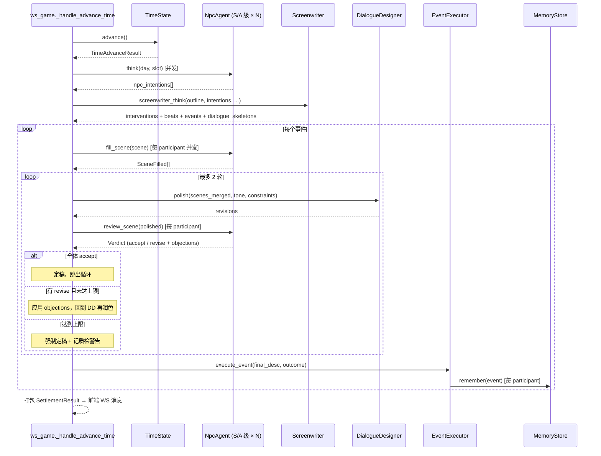

# NPC 多代理人架构

> 文档状态：初版
> 更新日期：2026-07-19
> 定位：Agent 化演进版，取代 `design/system/NPC行为系统.md` 中「AI 只润色文本、规则驱动优先」的 MVP 假设
> 面向读者：策划、后端研发、AI 提示词设计者

---

## 1. 概述

本架构定义《命运的织线》后端多 Agent 协作产生「事件 + 对白」的完整链路。核心变化：

- NPC 从「规则日程 + 状态标签」升级为拥有**决策、心理、三层记忆、自我表达能力**的独立 Agent。
- 事件不再是「编剧 Agent 一步生成的最终文本」，而是**多阶段管线**产物：
  编剧起骨架 → NPC 补台词 → 对白设计师润色 → NPC 校验 → 定稿 → 记忆回写。
- 每个环节都有明确的输入 / 输出契约，允许 1–2 轮迭代，最终产物同时具备**结构可结算**（delta 数值）与**文本可呈现**（分镜化对白）两个属性。

### 1.1 与既有文档的关系

| 文档 | 定位 | 与本架构的关系 |
|---|---|---|
| `design/system/NPC行为系统.md` | MVP 规则驱动规划（2026-06-12） | 已被本架构在「决策方式」「文本生成方式」上取代；日程、地点、状态标签的部分继续沿用 |
| `design/system/剧情大纲系统.md` | 大纲 / 节拍数据契约 | 本架构直接消费其产物，不改动契约 |
| `design/system/事件系统.md` | `EventTemplate` / `Outcome` / `SettlementResult` 结构 | 本架构在其结构基础上**追加**「对话骨架」与「定稿对白」两个字段 |
| `design/data/story_outline.json` | 大纲静态数据 | 编剧 Agent 唯一权威输入 |

---

## 2. 设计原则

| 原则 | 说明 |
|---|---|
| Agent 职责单一 | 每个 Agent 只做一件事，越权改动他人产出必须走契约字段（objections/revisions），不能直接改文本 |
| 骨架先行 | 事件文本一定要先有「谁在哪里为了什么」的骨架，再往里填台词。骨架决定结算，台词决定观感 |
| 数据可结算优先于文本 | 任何 Agent 输出必须能被降级为「无对白版事件」——即便 LLM 挂掉，游戏仍可推进 |
| 迭代有上限 | 润色—校验循环最多 2 轮，超过强制定稿并记质检警告，杜绝无限循环 |
| 参与者才能开口 | 只有事件 `participants` 里的 NPC 才生成台词；其他 NPC 不消耗 LLM 调用 |
| S/A 级并发、B/C 级降级 | 沿用现状：S/A 级 NPC 走 LLM，B/C 级走 `_default_action` 规则兜底，控制成本 |
| 记忆回写幂等 | 同一事件 + 同一 NPC 只写一次记忆，重放存档不会重复写入 |

---

## 3. 角色矩阵

| Agent | 现状 | 本架构新增职责 | 主要输入 | 主要输出 |
|---|---|---|---|---|
| **NPC Agent**（14×） | ✅ 已实现（`ai/npc_agent/agent.py`） | 补台词（scene 补全）、校验润色版是否符合人设 | 时段、三层记忆、bond 上下文、对话骨架片段 | 意图字符串、Scene 补全、Verdict 反馈、记忆写入 |
| **编剧 Agent** | ✅ 已实现（`ai/screenwriter/screenwriter.py`） | **在事件产物中追加对话骨架 scenes[]**（不再直接给最终文本） | 大纲、节拍库、NPC 意图、最近记忆、调性 | interventions + triggered_beats + spontaneous_events + **dialogue_skeletons** |
| **对白设计师 Agent** | 🔴 **全新** | 润色 NPC 拼接后的整段对白：节奏、口吻、去复读、tone 一致 | 定稿前对白 + 编剧给的 tone/constraints | Revisions 列表 + overall_note |
| **旁白 Agent** | ✅ 已实现（`ai/narrator/narrator.py`） | 保持不变：夜间土地公 80 字氛围旁白，不参与事件文本 | 当日事件摘要 | 单段旁白文本 |
| **LLM Client 基座** | ✅ 已实现（`ai/llm_client/`） | 保持不变：所有 Agent 共享 `chat()` 接口，支持 Llama / Anthropic 双后端 | prompt | completion |

---

## 4. NPC Agent 内部结构

### 4.1 组成字段（对应 `NpcAgent`）

```
NpcAgent
├── static:   NpcStatic         # 从 NPC基础表.csv 加载，一局不变
│   ├── id / display_name / age / role / description
│   ├── core_wish                # 核心愿望，驱动决策的锚
│   ├── attributes               # Mind / Faith / Physique / Charm
│   ├── personality              # Kindness / Aggression / Sensibility / Rationality / Curiosity
│   └── initial_locations
├── dynamic:  DynamicState      # 一局内可变
│   ├── location                 # 当前地点
│   ├── emotion / energy / happiness
│   └── flags                    # 剧情标签（例：接触过顾沉舟）
├── memory:   MemoryStore       # 情节记忆（三层复合）
│   ├── StructMemoryStore        # 结构化事件链，最多 50 条，超出触发精简
│   ├── VectorMemoryStore        # TF-IDF 向量检索
│   └── EpisodicRetrieval        # 艾宾浩斯遗忘 + 重要性加权
├── semantic: SemanticStore     # 语义记忆（对他人的印象、对世界的看法）
└── llm / bond_manager / name_map
```

### 4.2 心理模型（Psychology）

NPC 没有独立的「心理 Agent」层，心理状态由**性格常量 + 动态状态 + 记忆检索**在决策 prompt 中即时合成。字段来源如下：

| 心理维度 | 数据来源 | 用途 |
|---|---|---|
| 长期底色 | `personality.*`（Kindness/Aggression/…） | Prompt 里定义"你倾向于……" |
| 当下情绪 | `dynamic.emotion / energy / happiness` | Prompt 里描述"你现在感到……" |
| 关系态度 | `bond_manager.get(self, other)`（红/金/蓝/灰/黑 + 强度） | 补台词时描述对话对象观感 |
| 近期经历 | `memory.recent_events(n=5)` + `top_key_memories()` | 决策与补台词都会调用 |
| 世界观 | `semantic.all_impressions()` | 补台词时提供"你怎么看待某地/某群体" |

**关键约束**：NPC 不能直接读取其他 NPC 的私有 memory / semantic；跨 NPC 信息必须走 bond_manager 或事件结算的公开产物。

### 4.3 核心方法

| 方法 | 现状 | 职责 |
|---|---|---|
| `think(day, slot) -> str` | ✅ | 时段推进时产出"意图字符串"（例："想去港口看看陈海生"），供编剧参考 |
| `respond(context, speaker, day) -> str` | ✅ | 玩家单轮对话回应，与事件管线**不共用** |
| `fill_scene(skeleton_scene) -> SceneFilled` | 🔴 新增 | 接收单个 scene 骨架，只补自己 actor 的行 |
| `review_scene(polished_scene) -> Verdict` | 🔴 新增 | 检查润色版是否越权 / 走形 / 违反人设 |
| `remember(event, importance) -> None` | ✅ | 结算后写入三层记忆，幂等 |

---

## 5. 编剧 Agent 扩展

### 5.1 保留现状

- 输入：`story_outline` + `day/slot/week/phase_name` + `npc_intentions`（由所有 `think()` 聚合）+ 每 NPC 最近 5 条记忆
- 输出契约（已实现）：`{narrator_insight, interventions[], triggered_beats[], spontaneous_events[]}`
- 干预类型：`pass / soft_guidance / hard_orchestration`

### 5.2 新增职责：产出对话骨架

对每个即将执行的事件（无论 anchor / key / daily / spontaneous），编剧必须额外产出一份 `dialogue_skeleton`，作为对白管线的输入。**编剧不再直接写最终描述文本**——`EventTemplate.description` 由 scenes 定稿后回填。

产物结构见 §8.1。

### 5.3 与结算解耦

- Delta（resource/bond/karma）由 Outcome 决定，**与对白无关**——即使对白管线失败，事件仍能结算。
- 对白管线失败时，`EventTemplate.description` 回落到「骨架 goal 字段 + participants 名字」的模板文本，前端仍可展示。

---

## 6. 对白设计师 Agent（NEW）

### 6.1 定位

一个**只做文本审美的 Agent**，不改结算数据、不新增角色、不改事件走向。

### 6.2 输入

- 全体 NPC 补全后的 `SceneFilled` 拼接（按 beats 顺序）
- 编剧原骨架里的 `tone` + `constraints`
- 全场参与者的 `personality` 摘要（不看 memory，保持"外部编辑视角"）

### 6.3 润色维度

| 维度 | 说明 | 示例 |
|---|---|---|
| 口吻一致性 | 同一 NPC 前后行不出现风格突变 | 慧圆前半场文言、后半场白话 → 统一 |
| 节奏 | 长短句交错，避免连续大段独白 | 拆分或补 action 行 |
| 去复读 | 相邻两行不出现同义表述 | "我不知道""我不清楚" → 改一句 |
| Tone 收敛 | 全场符合骨架给的 tone | tone=隐晦紧张 → 删去过于直白的台词 |
| 长度控制 | 尊重 `constraints.max_length` | 超长则精简，不新增 |

### 6.4 禁止行为

- 不得新增 speaker
- 不得改变 beats 的 `must_convey`（关键信息传达）
- 不得修改 action 里描述的物理动作（会与场景不符）
- 不得引入未在骨架中出现的地点、道具、时间

### 6.5 输出

Revisions 列表，见 §8.3。**只输出 diff，不输出完整对白**——由外层管线合并。

---

## 7. 完整时间驱动链路

### 7.1 流程图



### 7.2 分步说明

1. **时段推进** `ws_game._handle_advance_time` 是唯一入口（保持现状）。
2. **NPC 决策并发** S/A 级 NPC 并发 `think()`，B/C 级 `_default_action`；产物为意图字符串列表。
3. **编剧编排** `screenwriter_think()` 消费大纲 + 意图 + 记忆样本；新增产出 `dialogue_skeletons`。
4. **NPC 补台词** 对每个事件，按 `participants` 拆分并发调用 `fill_scene()`；每个 NPC 只填自己的行。
5. **对白设计师润色** 拼接所有 SceneFilled 后交给 DD，产出 revisions（diff）。
6. **NPC 校验** 每个 participant 检查润色版是否有越权 / 走形；产 Verdict。
7. **迭代判断**
   - 全体 accept → 定稿
   - 有异议 & 未到 2 轮 → 应用 objections 回到润色步骤
   - 到达上限 → 强制定稿并记 `quality_flag=forced`
8. **事件结算** 定稿描述写入 `EventTemplate.description`；delta 由 Outcome 计算；前端收到 `event_triggered` 消息。
9. **记忆回写** `EventExecutor` 为每个 participant 写记忆，重要性按 anchor(9) / key(7) / 其他(5) 分档（沿用现状）。

### 7.3 降级路径

任一环节失败，按下表回退：

| 环节 | 失败表现 | 降级动作 |
|---|---|---|
| NPC.think() | LLM 超时 / 解析失败 | 走 `_default_action` 规则输出 |
| Screenwriter | LLM 超时 / JSON 解析失败 | 跳过 spontaneous_events，只走 CSV `match_events` 兜底 |
| 骨架生成 | 编剧输出无 skeleton | 事件描述回退为「goal + participants」模板 |
| NPC.fill_scene | 单个 NPC 失败 | 该 NPC 台词用性格模板兜底（例："性格 Rationality 高的 NPC 说：……"） |
| DialogueDesigner | LLM 超时 | 跳过润色，直接进入 review |
| NPC.review_scene | LLM 超时 | 默认 accept，记 `quality_flag=review_skipped` |
| 迭代超上限 | 2 轮仍未通过 | 强制定稿，记 `quality_flag=forced` |

---

## 8. 数据契约

### 8.1 对话骨架（编剧 → NPC / DD）

```json
{
  "event_id": "evt_lin_chaoyin_meets_huiyuan_day3",
  "scenes": [
    {
      "scene_id": "s1",
      "location": "temple",
      "day": 3,
      "slot": "afternoon",
      "participants": ["lin_chaoyin", "huiyuan"],
      "goal": "慧圆试探潮音是否已察觉寺庙腐败的暗示",
      "tone": "隐晦紧张",
      "beats": [
        {
          "beat_id": "b1",
          "actor": "huiyuan",
          "intent": "假意关心近况，实则观察潮音神情",
          "must_convey": "邀请她黄昏后再来寺庙一次",
          "must_avoid": "直接提及香火收入"
        },
        {
          "beat_id": "b2",
          "actor": "lin_chaoyin",
          "intent": "礼貌回应，内心警觉",
          "must_convey": "不明确答应，不明确拒绝",
          "must_avoid": "透露自己的巫女感应"
        }
      ],
      "constraints": {
        "max_length": 300,
        "forbidden_props": ["刀", "血"],
        "language_register": "半文半白"
      }
    }
  ]
}
```

### 8.2 NPC 补全（NPC → 管线）

```json
{
  "scene_id": "s1",
  "actor": "huiyuan",
  "lines": [
    {"beat_ref": "b1", "type": "action",   "text": "慧圆合掌，指尖微微发白。"},
    {"beat_ref": "b1", "type": "dialogue", "text": "潮音师妹近来面色清减，可是庙里事务累人？"},
    {"beat_ref": "b1", "type": "dialogue", "text": "今晚点灯时分，你若得闲，还是来一趟吧。"}
  ]
}
```

**约束**：`beat_ref` 必须指向骨架里 `actor==自己`的 beat；`type ∈ {action, dialogue, thought}`（thought 仅内心独白，前端可选渲染）。

### 8.3 润色反馈（对白设计师 → 管线）

```json
{
  "revisions": [
    {
      "line_ref": "s1.huiyuan[1]",
      "before": "潮音师妹近来面色清减，可是庙里事务累人？",
      "after":  "师妹面色清减，可是近日事务劳形？",
      "reason": "口吻收敛，减少现代口语气"
    },
    {
      "line_ref": "s1.lin_chaoyin[0]",
      "action": "delete",
      "reason": "与下一行重复语义"
    }
  ],
  "overall_note": "整体节奏偏散，删两行、合并两行后 tone 一致。"
}
```

`action` 可选值：`replace`（默认，用 `after` 替换）/ `delete` / `insert_after`（配合 `text` 字段）。

### 8.4 NPC 校验反馈（NPC → 管线）

```json
{
  "scene_id": "s1",
  "actor": "huiyuan",
  "verdict": "revise",
  "objections": [
    {
      "line_ref": "s1.huiyuan[1]",
      "reason": "慧圆此处不会主动示弱，'劳形'一词太文人化，她受过教育但不至于此。",
      "suggestion": "换回接近原句的口吻"
    }
  ]
}
```

`verdict ∈ {accept, revise}`；`revise` 必须至少提供一条 `objections`。

---

## 9. 迭代与终止条件

| 轮次 | 动作 | 终止判定 |
|---|---|---|
| 第 0 轮 | NPC 首次 `fill_scene` | 拼接后进入润色 |
| 第 1 轮 | DD 润色 → NPC review | 全体 accept → 定稿；有 revise → 进入第 2 轮 |
| 第 2 轮 | 应用 objections，DD 再润色 → NPC review | 全体 accept → 定稿；仍有 revise → 强制定稿 |

**强制定稿产物**：使用第 2 轮 DD 输出版本，附 `quality_flag=forced` 与 objections 快照，供事后调参分析。

**质检警告不阻塞游戏推进**——同一时段所有事件都必须在时段结束前定稿。

---

## 10. 与其他系统的接口

### 10.1 缘线 / 业线

- Delta 计算仍由 `Outcome.bond_delta / karma_delta` 决定，与对白无关。
- 对白设计师**不能**读写 bond / karma。
- NPC 在 `fill_scene` 里可以引用当前 bond 状态描述"她对他的观感"，但不能声明"这场戏之后关系变差"——那是 Outcome 的事。

### 10.2 前端 WebSocket 消息

现有 `event_triggered` 消息保留字段 + 新增：

```json
{
  "type": "event_triggered",
  "event_id": "...",
  "outcome_id": "...",
  "resource_changes": {...},
  "npc_changes": {...},
  "bond_changes": {...},
  "karma_changes": {...},
  "dialogue": {                     // 新增，缺失时前端回退为纯文本
    "scenes": [
      {
        "scene_id": "s1",
        "location": "temple",
        "lines": [
          {"actor": "huiyuan", "type": "dialogue", "text": "..."},
          ...
        ]
      }
    ]
  },
  "quality_flag": "ok | forced | review_skipped"
}
```

前端渲染契约在别的文档定义，此处只声明后端必产字段。

### 10.3 存档兼容性

- 对话骨架与最终定稿**不入存档**——重进游戏不重放对白，只保留结算结果与记忆。
- `quality_flag` 也不入存档，仅打点上报。
- 记忆写入的重要性 / anchor 判定沿用现状。

---

## 11. 对齐现状与新增工作量

| 环节 | 状态 | 新增工作 |
|---|---|---|
| NpcAgent.think() | ✅ 已实现 | 无 |
| NpcAgent.respond() | ✅ 已实现 | 无（与本管线不共用） |
| NpcAgent.fill_scene() | 🔴 全新 | 新增方法 + prompt 模板 + JSON 解析 + 降级 |
| NpcAgent.review_scene() | 🔴 全新 | 新增方法 + prompt 模板 |
| NpcAgent.remember() | ✅ 已实现 | 无 |
| Screenwriter interventions/beats | ✅ 已实现 | 无 |
| Screenwriter dialogue_skeleton 产出 | 🟡 扩展 | 输出契约扩字段 + prompt 追加骨架要求 + 解析容错 |
| DialogueDesigner Agent | 🔴 全新 | 新建 `ai/dialogue_designer/` 模块，含 prompt、client 调用、diff schema |
| 管线编排（迭代循环） | 🔴 全新 | 在 `ws_game._handle_advance_time` 或独立编排层里实现 fill→polish→review 循环 |
| Diff 合并器 | 🔴 全新 | 把 revisions 应用回 SceneFilled 的工具函数 |
| 前端 dialogue 字段渲染 | 🟡 扩展 | 前端 `DialogueEventScreen` 消费新字段（Godot 侧） |
| 质检打点 | 🔴 全新 | `quality_flag` 上报 + 强制定稿日志 |

---

## 12. 风险与开放问题

### 12.1 LLM 调用次数放大

单事件最坏情况：
- fill_scene: 每 participant 1 次 × N 人
- polish: 1 次
- review: N 次
- 迭代 2 轮 → (fill 1) + (polish 2) + (review 2N) = **2 + 3N 次 LLM 调用**

参考现状：单时段最多约 3 个 spontaneous_events + 若干 beat 事件。若平均 3 参与者、2 事件同时进行：**单时段最坏 ≈ 22 次 LLM 调用**，需在部署前确认 semaphore 与预算。

### 12.2 与 llama.cpp 本地后端的兼容

- 现状 `LoadBalancedClient` per_endpoint_concurrency=10，理论可撑。
- 校验步骤 review 的返回结构复杂度高于 think，本地小模型可能 JSON 输出不稳；建议 review 只允许 `accept` / `revise` + 简短 reason，不要求 line_ref 精确匹配（管线做模糊对齐）。

### 12.3 骨架越权检测

编剧可能在 beats 里给 NPC 塞"这不是我会说的话"（例：让慧圆当众表白）。当前设计允许 NPC review 阶段拒绝，但**首次 fill_scene 就应该拒绝写**——需要为 fill_scene 增加"骨架合理性预检"prompt 段落，直接返回 `objection` 走强制降级。

### 12.4 迭代收敛性

小样本测试后需要观察：**2 轮迭代内**能否收敛到全体 accept？若发现 > 30% 事件走强制定稿，应考虑：
- 编剧骨架里 tone/constraints 给得更严
- 允许第 3 轮但仅限有 objections 的少数 NPC 参与

### 12.5 玩家干预（托梦/护佑）的对白介入

现状：`ws_game._handle_apply_intervention` 直接写记忆。**开放问题**：是否需要让干预产生一个"感应场景"，走完整对白管线？倾向 MVP 阶段先不做，保持记忆写入即可。

### 12.6 与 CSV `match_events` 旧兜底事件的处理

CSV 事件没有骨架。降级策略：这类事件不进入对白管线，`description` 沿用 CSV 原字段，前端 `dialogue` 字段缺省。

---

## 附录 A：术语表

| 术语 | 定义 |
|---|---|
| **骨架 (Skeleton)** | 编剧产出的场景蓝图，含 goal / beats / tone / constraints，尚无最终台词 |
| **Beat** | 骨架内单个动作/发言单元，指定 actor + intent + must_convey |
| **Scene** | 单个场景，由多个 beats 组成，对应一个地点一段连续时间 |
| **SceneFilled** | NPC 根据自己 actor 的 beats 补出的台词集合 |
| **Revision** | 对白设计师对某一行的修改建议（replace/delete/insert） |
| **Verdict** | NPC 对润色版的裁决，accept 或 revise |
| **quality_flag** | 定稿质量标签：ok / forced / review_skipped，用于打点分析 |

## 附录 B：变更日志

| 日期 | 变更 | 作者 |
|---|---|---|
| 2026-07-19 | 初版，取代 NPC行为系统.md 的规则驱动章节；新增对白设计师 Agent、多阶段对话管线、4 个数据契约 | 系统分析（Claude Code） |
