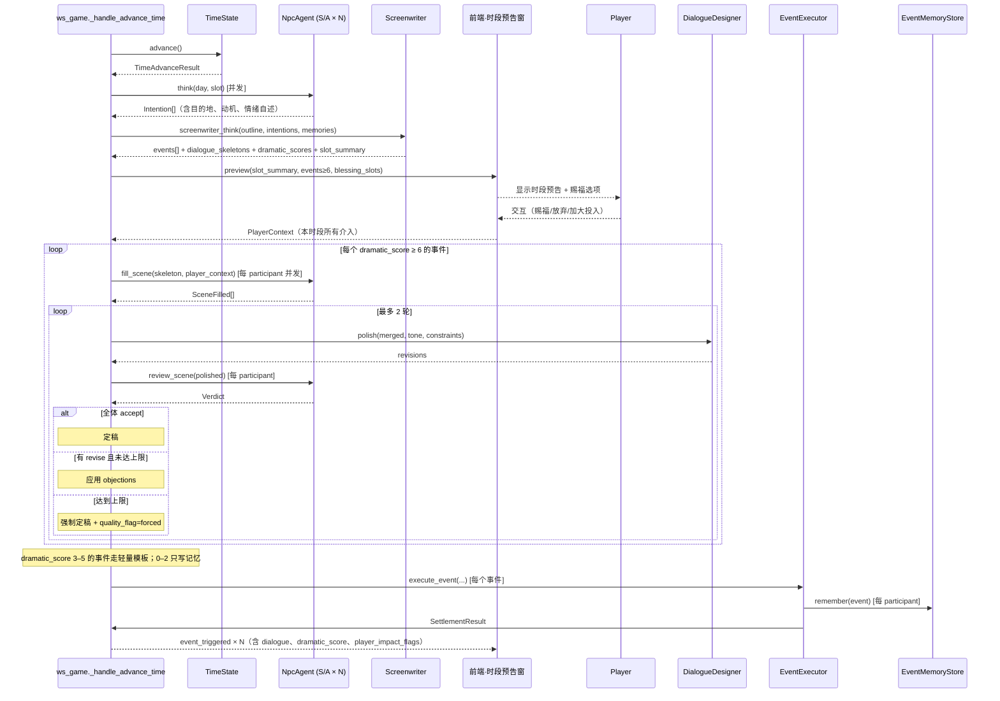

# 事件生成与玩家干预架构 v2

> 文档状态：策划提案
> 更新日期：2026-07-28
> 版本：v2.0
> 前置阅读：
> - [NPC-多代理人架构.md](./NPC-多代理人架构.md)（v1，本文档在其基础上演进）
> - [system/剧情大纲系统.md](../system/剧情大纲系统.md)
> - [system/事件系统.md](../system/事件系统.md)
> - [system/神力干预系统.md](../system/神力干预系统.md)
> - [system/缘线业线系统.md](../system/缘线业线系统.md)
> - [system/NPC行为系统.md](../system/NPC行为系统.md)
> 面向读者：策划、后端研发、AI 提示词设计者、前端 UI 研发

---

## 1. 概述

本架构定义《命运的织线》**"时段推进 → 事件生成 → 玩家介入 → 台词补全 → 定稿播出"**的完整循环。与 v1（`NPC-多代理人架构.md`）相比的核心变化：

1. **编剧 Agent 新增 0–10 戏剧冲突性评分**，替代旧版仅靠"anchor/key/daily"三档粗筛，为玩家干预的价值判断和资源分配（LLM 预算、UI 高亮）提供细粒度依据。
2. **玩家介入窗口前置**：骨架生成完毕、NPC 补台词**之前**，先弹出"时段预告"窗，编剧给出该时段所有事件的自然语言摘要 + 可赐福节点；玩家的交互结果（是否赐福、赐福投入的神力）作为参数**回喂**给 NPC 补台词阶段。
3. **托梦以香火为分量**：托梦不再有"轻/中/重"档位这种硬编码机制。玩家在夜晚只输入自然语言 `dream_text`；后端把当前**香火值**作为上下文一并交给 NPC Agent，由 NPC 在 prompt 中自行判断"这条托梦的分量有多重、是否听从、多认真提及"。神职的分量由 NPC 自感知，不是由玩家在 UI 上选档。
4. **NPC 三层记忆结构化**：静态、动态、事件记忆分别对应"永不变 / 一局内可变 / 一次事件产出"三种生命周期，接口收敛。

### 1.1 与既有文档的差异（速查）

| 主题 | v1（NPC-多代理人架构.md） | v2（本文档） |
|---|---|---|
| 事件筛选 | anchor / key / daily / spontaneous 4 档 | 保留 4 档 + 新增 0–10 冲突分（正交维度） |
| 玩家介入时机 | 只在 VN 段落级触发（赐福）+ 夜晚人物面板（托梦） | 新增"时段预告窗"介入点，早于 NPC 补台词 |
| 台词管线 | 骨架 → 填空 → 润色 → 校验（0–2 轮） | 保留，但填空阶段读入"玩家介入结果"作为额外上下文 |
| 托梦效果 | 写记忆（importance=8） | 写记忆 + 携带香火快照 + NPC prompt 自判分量 |
| 记忆分层 | StructMemory / VectorMemory / EpisodicRetrieval 混合层 | 显式三分：Static / Dynamic / Event，逐层不同生命周期 |

### 1.2 保留 v1 的部分

- Agent 职责单一原则、迭代上限 2 轮、S/A 级并发、B/C 级降级、参与者才开口、幂等记忆回写 —— 全部沿用。
- 对白设计师 Agent（`DialogueDesigner`）职责与契约不变。
- v1 §7 时序图作为**填空—润色—校验**内循环仍然成立；本文档在其外层追加"玩家介入回合"。

---

## 2. 设计原则

| 原则 | 说明 |
|---|---|
| 编剧决定"演什么"，NPC 决定"怎么说"，玩家决定"要不要偏转" | 三方职责严格分离，任何越权都不允许（编剧不写台词，NPC 不改事件走向，玩家不改结算 delta） |
| 冲突分驱动展示与资源 | 冲突分 ≥ 6 的事件才走完整对白管线；< 6 的事件用轻量模板，节省 LLM 预算 |
| 玩家介入前置 | 玩家看到的第一件事不是"事件已经发生"，而是"事件正要发生"——留出干预空间 |
| 数据可结算优先 | 即使玩家未介入 / LLM 失败 / 对白管线降级，事件仍能结算并推进时间 |
| 说服力可解释 | 托梦的分量与香火挂钩：香火高 → 神明音量大；NPC 自我诠释，不走硬编码档位 |
| 记忆不可篡改 | 事件记忆一旦写入不允许后续修改；玩家干预的痕迹作为**新记忆**追加，不覆盖 |

---

## 3. NPC 三层记忆模型

NPC 的所有内部状态收敛到三层，明确各自生命周期与写入方：

### 3.1 静态数据（`NpcStatic`）

**生命周期**：一局不变。由 `data/npc/NPC基础表.csv` 加载。

| 字段 | 类型 | 说明 |
|---|---|---|
| `id` | str | 唯一标识 |
| `display_name` | str | 名字 |
| `gender` | enum | `male` / `female` / `other` |
| `age` | int | 年龄 |
| `role` | str | 身份 / 职业（如"寺庙巫女"） |
| `identity_tag` | str | 身份标签（用于 UI 与 tone 一致性） |
| `description` | str | 一段人设描述 |
| `traits` | list[str] | 三个特质关键词 |
| `backstory_hint` | str | 背景钩子（玩家可见的短提示） |
| `core_wish` | str | 核心愿望（驱动决策的锚） |
| `personality` | dict | Kindness / Aggression / Sensibility / Rationality / Curiosity 5 维 |
| `attributes` | dict | Mind / Faith / Physique / Charm 4 维 |
| `initial_locations` | dict[slot, location] | 日程默认位置 |
| `agent_tier` | enum | S / A / B / C，决定是否走 LLM |

**约束**：静态字段**只读**，代码路径中不存在写入接口。

### 3.2 动态状态（`DynamicState`）

**生命周期**：一局内可变，随事件与时间推进变化。入存档。

| 字段 | 类型 | 说明 |
|---|---|---|
| `location` | str | 当前地点 |
| `emotion` | enum | 8 档情绪（neutral / happy / sad / angry / afraid / excited / hopeful / doubtful） |
| `energy` | int | 0–100 |
| `happiness` | int | 0–100 |
| `current_goal` | str | 当前时段的短目标（由 `think()` 产出） |
| `bonds` | dict[other_npc_id, BondEntry] | 与其他 NPC 的缘线（类型 / 强度 / 可见性 / 最近变化） |
| `karma_main_progress` | float | 主业线进度 0.0–1.0 |
| `karma_side_progress` | dict[side_id, float] | 侧业线进度 |
| `flags` | set[str] | 剧情标签集合 |

**写入方**：
- `NpcAgent.think()` 更新 `current_goal`
- `EventExecutor.settle()` 应用 Outcome 的 delta（bond / karma / emotion）
- 玩家干预（`apply_intervention`）通过写事件记忆间接影响下一时段的 `think()`

### 3.3 事件记忆（`EventMemory`）

**生命周期**：一次事件产出一条，写入后不改。入存档。

```python
@dataclass
class EventMemoryEntry:
    memory_id: str            # 唯一标识
    day: int
    slot: str                 # "morning" | "afternoon" | "night"
    event_id: str             # 关联事件
    description: str          # 从"自己"视角写的一段回忆文本
    importance: int           # 1–10，供检索加权
    emotion_at_time: str      # 写入瞬间的情绪快照
    participants: list[str]   # 事件参与者 id
    location: str
    source: str               # "event" | "dream" | "blessing_felt" | "ambient"
    dream_incense_snapshot: int  # 若 source=dream，写入时的香火值快照（供 NPC 未来回忆时理解"当时神明的分量"）；否则 0
    dream_text: str           # 若 source=dream，玩家原文；否则 ""
```

**检索接口**：
- `recent(n=5)` — 最近 n 条
- `top_important(n=3)` — 重要度 top n
- `about_npc(other_id)` — 涉及某个 NPC 的记忆
- `by_source(source)` — 按来源筛选（例：查询本 NPC 收到的所有梦）

**沿用 v1**：
- 存储实现仍是 `StructMemoryStore` + `VectorMemoryStore` + `EpisodicRetrieval` 三层（艾宾浩斯遗忘 + 重要性加权），只是**对外接口**收敛为上述 4 个方法。
- 幂等：同 `event_id + npc_id` 只写一次。

---

## 4. AI NPC Agent

### 4.1 组成

```
NpcAgent
├── static:  NpcStatic               # §3.1，只读
├── dynamic: DynamicState            # §3.2
├── memory:  EventMemoryStore        # §3.3
├── llm:     LLMClient               # 复用 ai/llm_client/
└── bond_manager: BondManager        # 全局共享
```

NPC 不存"心理 Agent"，心理由 `personality（静态）+ emotion / energy / happiness（动态）+ 近期记忆检索` 在 prompt 中即时合成。

### 4.2 能力（对外方法）

| 方法 | 时机 | 输入 | 输出 |
|---|---|---|---|
| `think(day, slot) -> Intention` | 时段推进第 1 步 | 日程、动态状态、最近 5 条事件记忆 | `Intention`（见 §9.1） |
| `fill_scene(skeleton, player_context) -> SceneFilled` | 骨架生成 + 玩家介入之后 | 单个 scene 骨架 + 玩家介入结果 | `SceneFilled`（见 §9.5） |
| `review_scene(polished) -> Verdict` | 对白设计师润色之后 | 润色后的整段对白 | Verdict（accept / revise + objections） |
| `remember(event, importance) -> None` | 事件结算完成后 | 事件产物 | 幂等写入 EventMemoryStore |
| `receive_dream(dream_text, incense_snapshot) -> None` | 玩家托梦时 | 自然语言文字 + 当前香火值快照 | 写入一条 `source=dream, dream_incense_snapshot=<value>, dream_text=<原文>` 的事件记忆；分量由 NPC prompt 在读取时自行诠释 |

**关键新增**：`fill_scene` 的第 2 个参数 `player_context` 是本轮玩家在"时段预告窗"里做过的所有交互（赐福节点/放弃赐福/加大神力投入等），NPC 补台词时会感知到"神明似乎在关注这场戏"或"神明对某某表示了眷顾"。

### 4.3 决策依赖静态与动态的边界

NPC 决策时优先级：

1. `core_wish`（静态）—— 最高，长期锚点
2. 近期 3 条高重要度事件记忆（含托梦） —— 短期驱动
3. `emotion` + `energy` —— 修正当前语气与激烈程度
4. `bonds` —— 决定对话对象的态度
5. `personality` —— 兜底：无明确输入时按性格倾向选择

**NPC 不能直接读取其他 NPC 的 memory / dynamic**。跨 NPC 信息只能通过 `bond_manager` 或事件结算的公开产物流通。

---

## 5. 编剧 Agent

### 5.1 保留 v1 职责

- 消费 `story_outline`（大纲）+ `day/slot/week/phase_name` + `npc_intentions`（本轮 `think()` 聚合结果）+ 每 NPC 最近 5 条记忆。
- 输出 `interventions[]`（放行 / 软引导 / 硬编排三选一）、`triggered_beats[]`、`spontaneous_events[]`。
- 产出 `dialogue_skeleton`（v1 §8.1 契约不变）。

### 5.2 新增能力

#### 5.2.1 戏剧冲突性评分 `dramatic_score`

编剧对**每个即将产出的事件**（包括节拍事件与即兴事件）给出一个整数分 `0–10`：

| 分段 | 语义 | 处理策略 |
|---|---|---|
| **0–2** | 环境氛围（例：某 NPC 独自吃早餐） | **不进入对白管线**。仅写一条 `source=ambient` 的低重要度记忆；前端不显示卡片。 |
| **3–5** | 日常互动（例：两人闲聊、路人打招呼） | **轻量模板管线**：编剧直接给一句 30 字内的描述文本，跳过 fill/polish/review。 |
| **6–8** | 显著戏剧（例：争吵、告白、决定） | **完整对白管线**：走 fill → polish → review 0–2 轮。 |
| **9–10** | 转折 / 命运节点 | 完整管线 + **强制暴露为"时段预告窗"高亮项**，玩家可赐福节点数量 +1。 |

**评分维度提示词**（写在编剧 system prompt 中）：
- 是否涉及关系逆转 / 秘密揭示 / 抉择时刻
- 是否触碰节拍库中的 anchor / key beat
- 参与者情绪极值（emotion ≠ neutral 且 |happiness_delta| ≥ 15 加分）
- 玩家近期干预是否指向本事件的参与者（+1 分，鼓励回应玩家意图）

**评分不可篡改**：编剧输出后，评分固化为事件属性；后续 NPC / 对白设计师 / 玩家均不能修改。

#### 5.2.2 时段摘要生成

在事件骨架产出后，编剧额外生成一段"时段预告"文本（下述 §7.2 使用），字数 60–120 字，语气从土地公视角，例：

> "今晨的港口比往日更沉。陈海生的船迟迟未出，你隐约听见他与顾沉舟在船舱里争执什么。 若你有心相助，此刻或可在他们的相遇处轻拨命运一二。"

摘要要求：
- 只描述"将要发生什么氛围"，**不剧透结果**
- 只涉及 `dramatic_score ≥ 6` 的事件参与者
- 明确点出**至少一个可赐福节点**的所在（若本时段有）

---

## 6. 完整时段循环

### 6.1 时序图



### 6.2 分步说明

1. **时段推进** —— `TimeState.advance()`，保留 v1 现状。
2. **NPC 并发决策** —— S/A 级 NPC 并发 `think()`，产出 `Intention`（§9.1）。B/C 级走 `_default_action` 规则兜底。
3. **编剧编排** —— 消费大纲 + 意图 + 记忆样本，产出所有事件骨架 + 冲突分 + 时段摘要。
4. **时段预告窗**（新增） —— 前端弹出 modal，展示摘要与可赐福节点，玩家决策后回传 `PlayerContext`。
5. **NPC 补台词** —— 对 `dramatic_score ≥ 6` 的事件，参与者并发 `fill_scene(skeleton, player_context)`。
6. **对白设计师润色 + NPC 校验** —— 沿用 v1 §7 内循环（0–2 轮）。
7. **事件结算 + 记忆回写** —— 定稿后 `EventExecutor` 结算 Outcome、写入 EventMemoryStore。
8. **前端播放** —— 逐事件 `event_triggered` 推送，前端进入 VN 演出（段落级赐福已在 §7 时段预告窗前置消费掉，此处不再插入）。

### 6.3 关键差异：赐福时机的迁移

v1：赐福节点嵌在 VN 对话段落里，玩家看到台词的过程中被打断做决策。
v2：赐福节点**全部前置到时段预告窗**，玩家一次性决定完再看演出。

**理由**：
- 玩家看到台词已经先入为主，段落级决策变成"追认"而非真正影响；前置到骨架阶段能真正改变 NPC 补出来的台词。
- UI 层减少中断，VN 演出连贯性提升。
- 编剧摘要给玩家的信息量与"看到台词"接近，但保留悬念（不剧透结果）。

**保留 v1 段落级赐福的可选路径**：若某事件 `dramatic_score = 10` 且骨架标注 `mid_scene_intervention: true`，仍允许一个中场赐福点（用于极高冲突事件的高潮时刻）。

### 6.4 降级路径

沿用 v1 §7.3 全部降级策略，新增：

| 环节 | 失败表现 | 降级 |
|---|---|---|
| Screenwriter dramatic_score 缺失 | LLM 输出未含 score | 默认给 5 分，走轻量模板 |
| Screenwriter slot_summary 缺失 | LLM 输出未含摘要 | 拼接"今日 {slot}，镇上似乎有些动静。"占位 |
| 时段预告窗超时 | 玩家 30s 未响应 | 默认无赐福，直接进入 fill_scene |
| PlayerContext 空 | 玩家跳过 | NPC 补台词按"神明未干预"路径生成 |

---

## 7. 玩家介入

### 7.1 三种介入渠道

| 渠道 | 时机 | 频次 | 消耗 | 效果 |
|---|---|---|---|---|
| **时段预告赐福** | 时段推进后、事件播出前 | 每个赐福节点 1 次 | 3 神力 / 次（默认，可按事件难度浮动） | 影响该事件走向（改变 outcome 概率 + 影响 NPC 补台词语气） |
| **中场赐福**（仅 score=10 事件） | VN 演出关键点 | 每事件 ≤ 1 次 | 3 神力 | 段落级二次机会 |
| **托梦** | 夜晚 | 每晚 1 次 1 人 | 3 神力（固定入场费） | 写入目标 NPC 的事件记忆（携带**当前香火值快照**）；NPC 在决策 / 补台词时读取本条梦 + 香火值，由 prompt 自判分量 |

### 7.2 时段预告窗（新增 UI）

**触发**：`ws_game._handle_advance_time` 在编剧输出后、fill_scene 前，向前端推送 `slot_preview` 消息。

**内容**：
- 时段摘要文本（编剧产出）
- 可赐福节点列表：每项包含 `event_id / npc_names / location / difficulty_hint / cost / player_choice`
- 玩家操作：
  - 对每个节点选择"赐福"或"放弃"
  - 可为部分节点"加大投入"（消耗 +2 神力 → 该节点 base_coins +1）
  - "全部确认" → 关闭窗口，进入 fill_scene

**产出**：`PlayerContext`（§9.4）—— 结构化的玩家介入清单。

**降级**：网络断线 / 玩家超时 / 玩家跳过 → PlayerContext 为空，事件继续。

### 7.3 玩家介入如何影响事件

介入结果通过 `PlayerContext` 输入到两个位置：

1. **`NpcAgent.fill_scene(skeleton, player_context)`**：
   - NPC 感知到"神明是否眷顾了这场戏"
   - 若参与者感知到赐福 → 台词更积极 / 语速更沉稳 / 出现"心头突然一暖"类型的 action
   - 若参与者感知到"神明关注但未赐福" → 出现犹豫、观望的台词
   - 神明未介入 → 完全按 NPC 自身状态补
2. **`EventExecutor.settle()` Outcome 结算**：
   - 赐福节点消耗神力、判定命运硬币、影响 outcome 分支概率
   - 沿用 `design/system/神力干预系统.md` §6 的硬币机制

**信息屏障**：
- NPC **不知道玩家投入了多少神力**，只感知"是否被眷顾"（bool）
- 玩家**不知道 NPC 内心的完整想法**，只看到预告摘要与最终演出
- 编剧**不知道玩家介入前的意图**，只在骨架生成完毕后接收 `PlayerContext` 用于后续微调（若允许"应急二次编排"，见 §12.3 开放问题）

---

## 8. 托梦系统

### 8.1 设计立场：不设档位，由 NPC 自我诠释

托梦**没有**"轻/中/重"或"1/2/3 档"这种硬编码档位。玩家在夜晚 UI 里只做两件事：
1. 选择托梦对象（1 名 NPC）
2. 输入自然语言 `dream_text`（≤ 100 字）

系统层面：
- 消耗神力固定 `3`（入场费，防止刷梦）
- 每晚 1 次 1 人（沿用现状）
- 神力不足时禁用托梦按钮

**分量不由 UI 决定，由 NPC 在 prompt 中读取「当前香火值快照」后自行判断。**

香火在《命运的织线》里代表"神明在世间被记得的程度"（参见 `design/system/资源系统.md` §5）。同一句 `dream_text`，在香火 20 时听起来是"耳边一丝无谓的杂音"，在香火 150 时听起来则是"神威降临的启示"。这契合世界观："人对神的敬畏正比于神在世间的存在感"。

### 8.2 数据流

托梦触发时（前端 → 后端 `_handle_apply_intervention`）：
1. 后端读取当前 `resources.incense`（香火值）
2. 后端调用目标 NPC 的 `receive_dream(dream_text, incense_snapshot=<当前香火值>)`
3. `NpcAgent` 写入一条 `EventMemoryEntry(source="dream", dream_text=<原文>, dream_incense_snapshot=<香火值>, importance=<由 NPC 首次读入时的 prompt 自评，默认 5>)`

后续任意时刻（`think()` / `fill_scene()`）NPC 读取自己的 dream 记忆时，把 `dream_incense_snapshot` 与 `dream_text` 一并送入 prompt。

### 8.3 NPC 侧的 prompt 契约

NPC system prompt 中追加一段固定块（每次 `think` 与 `fill_scene` 都注入）：

```
你是一个凡人，无法直接看到神明。但你对"神迹的分量"有直觉，且这份直觉与镇上香火的兴衰同步：
- 若这条梦标注的 <incense_snapshot> 值很低（如 0–40），说明托梦时神明在镇上几乎被遗忘，梦境更像
  一次偶发的杂念或不安，你可以怀疑、忽略、甚至反着来。
- 若为中等（40–100），梦是一份"心里挥之不去的暗示"，你会认真考虑但不必盲从。
- 若很高（100–150），是一份"仿佛有人在耳边低语"的确切感觉，你倾向遵循，但仍受本心（core_wish）
  和情绪判断驱使。
- 若极高（150+），你把它当作"神谕"，除非违背本心的最深处，否则会照做。

分量高低不是权重公式，是你对"神明是否真的在关心我"的主观感受。请把它反映到你的动机、
情绪、行动选择和台词中。你可以说出"昨夜有个模糊的梦"或"神明似乎并未真的关注我们"
这样的话，也可以只让它默默影响决策。
```

**关键点**：
- **没有数字权重表**。区段（0–40 / 40–100 / 100–150 / 150+）只是给 LLM 的语义锚点，不是硬编码规则。NPC 输出仍可能"香火 130 但我不听"或"香火 30 但我隐约在意"，这是 NPC 人格差异带来的合理噪声。
- NPC 的输出仍受 `core_wish`、`personality`、`emotion`、`bonds`、`dramatic_score ≥ 8 事件的自然演进保护`（见 §8.5）约束。
- 香火快照**是当时的快照**，事后香火涨跌不会追溯性改变梦的分量。这符合"记忆是当时的心境"的直觉。

### 8.4 记忆衰减

不再按"档位"设定不同衰减速度。dream 记忆按 `EventMemoryEntry.importance` 走既有 `EpisodicRetrieval` 艾宾浩斯遗忘曲线：
- 首次写入时 `importance` 默认 5
- NPC 在下次 `think()` 读入本梦时，可通过 prompt 自评"是否觉得这个梦更值得记住"，允许 `importance` 上调至最多 8（相当于 NPC 主动加深印象）
- 若 NPC 在多个连续时段中都感觉"这梦没什么用" → `importance` 自然衰减更快

这套自适应衰减比硬编码"档位 → 天数"更贴合"梦是主观印象"的直觉。

### 8.5 边界：托梦不能做什么

托梦**不能**：
- 让 NPC 违反 `core_wish` 做出根本人格转变
- 让 NPC 记住玩家未托梦的内容（NPC 会自动无视矛盾梦境）
- 覆盖 `dramatic_score ≥ 8` 事件的自然演进（这些事件不受托梦短期影响）
- 通过反复重复同一 `dream_text` 强行"洗脑"（NPC prompt 中显式说明：多次同一内容的梦被视为一次强化，不做叠加）

托梦**能**：
- 让 NPC 更倾向去某个地点
- 让 NPC 对某个人多一层观察 / 疑虑 / 期待
- 提前透露一个"感觉"（如"你觉得今晚不该去港口"）
- **在香火高时**几乎完全说服 NPC；**在香火低时**梦几乎无效

### 8.6 与神力经济的关系

- 入场费固定 3 神力，不因香火高低变化——这是"发出梦"的成本。
- 玩家想让托梦有分量 → 不要单独攒神力，而是先攒香火。这自然把"神力经济"与"香火经营"拉入同一决策链条。
- 前端 UI 可显示当前香火对应的语义提示（如"香火：32/低——你的托梦可能像风一样飘过去"），帮助玩家形成预期，但**这段提示只是文案，不代表实际权重**。

---

## 9. 数据契约

### 9.1 NPC Intention（NPC → 编剧）

```json
{
  "npc_id": "lin_chaoyin",
  "day": 3,
  "slot": "afternoon",
  "planned_location": "temple",
  "action_summary": "打算去寺庙帮慧圆打理香火，但心里对昨夜的梦仍有疑虑。",
  "emotion_self_report": "doubtful",
  "energy": 65,
  "top_concerns": [
    {"about_npc": "huiyuan", "note": "他昨天欲言又止"},
    {"about_event": "temple_incense_dwindling", "note": "香火减少似乎与我有关"}
  ],
  "dream_influence": {
    "recent_dream_text": "昨夜梦到有人叫我今晚别去港口",
    "incense_snapshot_at_dream": 72,
    "self_interpretation": "神明的声音这几日似乎清晰，我倾向留意这份梦。"
  }
}
```

### 9.2 编剧输出（Screenwriter → 管线）

```json
{
  "slot_summary": "今晨的港口比往日更沉。……",
  "interventions": [
    {"beat_id": "b_w1_d3_afternoon", "type": "soft_guidance", "hint": "让潮音自然接触寺庙暗流"}
  ],
  "triggered_beats": [
    {"beat_id": "b_w1_d3_afternoon", "event_id": "evt_temple_hint"}
  ],
  "spontaneous_events": [
    {
      "event_id": "spontaneous_port_argument_d3_morning",
      "location": "port",
      "participants": ["chen_haisheng", "gu_chenzhou"],
      "dramatic_score": 8,
      "goal": "两人为船只出海时机争执",
      "outcome_id": "port_argument_defer",
      "dialogue_skeleton": { "scenes": [ ... ] }
    }
  ]
}
```

`dialogue_skeleton` 结构沿用 v1 §8.1，此处不再重复。

### 9.3 时段预告推送（后端 → 前端）

```json
{
  "type": "slot_preview",
  "day": 3,
  "slot": "morning",
  "summary": "今晨的港口比往日更沉。……",
  "blessing_slots": [
    {
      "event_id": "spontaneous_port_argument_d3_morning",
      "event_name": "港口争执",
      "location_id": "port",
      "location_label": "港口",
      "participants": ["chen_haisheng", "gu_chenzhou"],
      "participant_names": ["陈海生", "顾沉舟"],
      "difficulty_hint": "困难",
      "base_cost": 3,
      "dramatic_score": 8,
      "hint_text": "你或可在他们的相遇处轻拨命运一二。"
    }
  ],
  "timeout_sec": 30
}
```

### 9.4 PlayerContext（前端 → 后端）

```json
{
  "type": "slot_preview_response",
  "day": 3,
  "slot": "morning",
  "decisions": [
    {
      "event_id": "spontaneous_port_argument_d3_morning",
      "action": "bless",
      "extra_investment": true,
      "coin_result": {"success": true, "heads": 2, "coins_thrown": 3}
    }
  ],
  "player_total_cost": 5
}
```

`action ∈ {bless, skip}`；`extra_investment` 为 true 时神力消耗 +2 且 base_coins +1；`coin_result` 在前端本地投掷（沿用当前实现），后端只做落库与向 NPC 广播 `blessed` 标记。

### 9.5 SceneFilled（NPC → 管线）

沿用 v1 §8.2 结构，新增可选字段：

```json
{
  "scene_id": "s1",
  "actor": "chen_haisheng",
  "perceived_blessing": true,          // 由 player_context 传入
  "dream_influence_applied": {         // 若本次补台词受托梦影响
    "recent_dream_text": "让他别急着出海",
    "incense_snapshot_at_dream": 72,
    "npc_narrative_weight": "moderate"  // NPC 自评：ignored / faint / moderate / strong / divine
  },
  "lines": [
    {"beat_ref": "b1", "type": "action", "text": "陈海生的手停在缆绳上，忽然觉得掌心一暖。"},
    {"beat_ref": "b1", "type": "dialogue", "text": "……算了，今日不出海。"}
  ]
}
```

### 9.6 事件推送（后端 → 前端）

沿用 v1 §10.2 `event_triggered`，新增字段：

```json
{
  "type": "event_triggered",
  "event_id": "...",
  "dramatic_score": 8,
  "player_impact_flags": {
    "blessed": true,
    "coin_success": true,
    "extra_investment": true
  },
  "dialogue": { ... },
  "quality_flag": "ok"
}
```

前端可依据 `dramatic_score` 决定卡片视觉强度，`player_impact_flags` 决定是否显示"神迹显现"特效。

### 9.7 托梦推送（前端 → 后端）

```json
{
  "type": "apply_intervention",
  "payload": {
    "intervention_id": "dream_hint",
    "target_npc_ids": ["lin_chaoyin"],
    "dream_text": "港口今晚有危险，不要去。",
    "cost": 3
  }
}
```

后端 `_handle_apply_intervention`：
1. 校验神力 ≥ 3、当晚未托梦、目标 NPC 合法
2. 读取 `resources.incense` 作为 `incense_snapshot`
3. 调用 `NpcAgent.receive_dream(dream_text, incense_snapshot)`，写入一条 `EventMemoryEntry(source="dream", dream_text=<原文>, dream_incense_snapshot=<snapshot>)`
4. 扣 3 神力，标记当晚已托梦

**前端不发送**任何"档位"字段。UI 里可显示"当前香火：{value}"作为文案参考，但不作为参数传递。

---

## 10. 与现有系统的接口

### 10.1 剧情大纲系统

- 编剧 Agent 消费大纲的方式**不变**（沿用 `design/system/剧情大纲系统.md`）。
- 大纲节拍的 `must_happen` 约束优先级 > `dramatic_score`：即使评分低，anchor beat 也必须被触发（此时评分作为"事件表现强度"参数而非"是否触发"参数）。

### 10.2 事件系统

- `EventTemplate` 结构追加：`dramatic_score: int`、`slot_summary_ref: str`（指向本时段摘要 id）。
- 现有 `Outcome` / `SettlementResult` 结构不变。
- `dramatic_score ≤ 2` 的事件不产出 `event_triggered` 消息，只写记忆。

### 10.3 神力干预系统

- 现有干预类型表（`design/system/神力干预系统.md` §3）**不**新增 UI 档位。托梦保持"固定 3 神力 / 每晚 1 次 / 1 人 / 100 字自然语言"的入口。
- 后端在 `_handle_apply_intervention` 中额外读取 `resources.incense` 并作为 `incense_snapshot` 写入 `EventMemoryEntry`。
- 赐福的入口从"事件面板下拉"迁到"时段预告窗"（v1 已迁到"VN 段落级"→ v2 再迁到"时段预告窗前置"）。
- 命运硬币算法完全不变。

### 10.4 缘线业线系统

- 玩家介入不直接改 bond / karma；delta 仍由 Outcome 决定。
- 托梦记忆可能间接影响 NPC 在下次事件中的抉择，从而经由 Outcome 影响缘线业线。
- 说服力权重**不入**缘线业线的计算公式。

### 10.5 前端 WS 消息汇总

新增 3 条：

| 消息 | 方向 | 触发 |
|---|---|---|
| `slot_preview` | 后端 → 前端 | 编剧输出后 |
| `slot_preview_response` | 前端 → 后端 | 玩家完成预告窗交互后 |
| `slot_preview_timeout` | 后端 → 前端 | 30s 未响应时后端主动通知（可选） |

现有的 `event_triggered` / `settlement_complete` / `time_advanced` 保持消息类型不变，仅字段扩充。

### 10.6 存档兼容性

- 记忆按 §3.3 结构入存档
- `dramatic_score` 不入存档（仅前端 UI 使用）
- `PlayerContext` 不入存档（是本时段瞬时输入）
- `dream_incense_snapshot` + `dream_text` 入存档（NPC 复盘时读取香火快照感知分量）

---

## 11. 与 v1 架构的兼容与迁移

### 11.1 兼容性

| v1 概念 | v2 是否保留 | 备注 |
|---|---|---|
| Screenwriter `interventions[]` 三选一 | ✅ | 完全保留 |
| Screenwriter `dialogue_skeleton` | ✅ | 结构不变 |
| `fill_scene / review_scene` | ✅ | fill_scene 增加 `player_context` 参数 |
| DialogueDesigner Agent | ✅ | 完全保留 |
| 2 轮迭代上限 | ✅ | 完全保留 |
| `quality_flag` | ✅ | 完全保留 |
| S/A 级并发 / B/C 级降级 | ✅ | 完全保留 |
| 段落级 blessing_prompt | 🟡 部分 | 仅 `dramatic_score=10` 事件保留 |
| 幂等记忆回写 | ✅ | 完全保留 |
| CSV 兜底匹配 | ✅ | 完全保留（走轻量模板路径） |

### 11.2 迁移增量

按落地顺序：

1. **编剧输出 schema 扩展**：追加 `dramatic_score` + `slot_summary`（编剧 prompt 修改 + JSON 解析容错）
2. **后端管线接入冲突分分流**：`dramatic_score < 6` 走轻量模板、`≥ 6` 走完整管线
3. **`ws_game._handle_advance_time` 插入时段预告窗回合**：新增 `slot_preview` 推送 + 30s 等待 `slot_preview_response`
4. **前端时段预告窗 UI**（新场景 `SlotPreviewDialog.tscn`）
5. **托梦 UI 保持简约**（`DreamTextDialog` 不加档位选择器；可选加一行"当前香火：{value}"的文案）
6. **`NpcAgent.fill_scene` 追加 `player_context` 参数** + prompt 模板加入"是否感应到神明眷顾"块 + 加入 §8.3 托梦分量诠释块
7. **`EventMemoryEntry` 追加 `dream_incense_snapshot` + `dream_text` 字段** + 检索 API `by_source(source)`
8. **`_handle_apply_intervention` 读取当前 `resources.incense` 并作为 snapshot 写入**（不读取任何 tier 字段）
9. **前端 `event_triggered` 消费 `player_impact_flags`** + 视觉特效
10. **回归测试与调参**（观察冲突分分布 / 玩家介入率 / LLM 调用量变化）

### 11.3 灰度策略

- 阶段 1：仅上线冲突评分（不改任何流程），观察分布是否合理（预期 6+ 事件占 30–50%）
- 阶段 2：上线时段预告窗（默认关闭，Settings 开关开启体验）
- 阶段 3：上线托梦香火快照 + NPC prompt 分量诠释块
- 阶段 4：全量启用

---

## 12. 风险与开放问题

### 12.1 LLM 调用次数评估

对比 v1（v1 §12.1 估算单时段最坏 22 次），v2 变化：
- **减少**：`dramatic_score < 6` 事件不走 fill/polish/review，节省大量调用
- **增加**：编剧 prompt 加长（要产出冲突分与摘要），单次调用 tokens +~30%

预估**净减少 20–30%**（因低分事件占比预计 50%+）。

### 12.2 冲突分主观性

编剧对同一事件可能给出不同评分（LLM 输出不稳）。缓解：
- 评分参考维度写死在 system prompt
- 输出后端做一次"稳定性检验"：连续 2 次调用同一事件评分差 ≤ 2 分才落库；否则取平均
- 长期积累标注数据，训练评分校准提示词

### 12.3 玩家介入后的"应急二次编排"

**开放问题**：玩家在时段预告窗做出强干预（例：赐福 3 个节点全部加大投入）后，编剧是否应该二次调用，微调事件走向？

- **倾向 v2 首版不做**：只把 PlayerContext 灌到 NPC 补台词阶段，编剧骨架不变。理由：多一次 LLM 调用带来的收益 vs. 成本不明。
- **保留扩展点**：`ws_game` 中 fill_scene 前预留 `_maybe_reorchestrate(player_context, events)` 钩子，未来可插入。

### 12.4 时段预告窗的信息量

**风险**：摘要过详 → 剧透；过简 → 玩家无法决策。
- 首版限制：60–120 字，只描述参与者情绪与地点氛围
- 评估指标：玩家赐福率、赐福后事件走向变化率
- 若赐福率 < 15% → 摘要信息过少，反之 > 60% → 剧透过重

### 12.5 香火与托梦的经济耦合

- 托梦入场费固定 3 神力；分量由**当前香火值**决定。这把"神力经济"与"香火经营"耦合到同一决策链：想让梦有分量 → 先经营香火。
- 潜在问题：早期香火低（初值 50）时，玩家托梦几乎无效，可能导致教学期挫败感。
- 缓解：新手教程或首次托梦时，前端 UI 明确显示当前香火对应的语义（如"你的托梦可能像风一样飘过去"），设定预期而非制造挫败。
- 观察指标：不同香火段位下托梦频次分布 / NPC 输出中"忽略梦"vs"遵循梦"的比例。若 NPC 对香火 < 40 的梦 100% 忽略 → prompt 语义需软化；若香火 > 120 时 100% 遵循 → 加强 core_wish 约束。

### 12.6 时段预告与 VN 演出的信息重复

**风险**：玩家看完预告后再看 VN 感觉"已经知道结果"。
- 摘要**必须**保持悬念（编剧 prompt 明确禁止透露 outcome）
- VN 演出通过 NPC 台词、赐福后的反应展现细节，与摘要形成"从外看 vs 从内看"两层
- 若玩家反馈"看完 VN 无新信息" → 摘要过度剧透，需要收敛

### 12.7 与"直接命令 NPC"的世界观边界

香火极高时（如 150+）的托梦是否等价于"命令"？答：不等价——
- 高香火托梦仍受 `core_wish` 与 `dramatic_score ≥ 8` 事件的自然演进保护
- NPC 感觉是"神明启示"而非"外部指令"，输出仍需通过 NPC 自身语气与选择表达
- 世界观上仍保持"土地公不能命令人类"的原则：神只放大存在感，不夺走凡人的选择

若测试中发现 NPC 对高香火托梦 100% 服从（决策 100% 遵循 `dream_text`），做法**不是**加数字权重上限，而是：
- 强化 §8.3 prompt 中"仍受本心与情绪驱使"的表述
- 在 NPC static prompt 中显式列举本 NPC 的"神明也无法动摇的执念"

---

## 附录 A：字段命名对照表

| 本文档 | 后端代码（现有） | 前端 GDScript（现有） |
|---|---|---|
| `NpcStatic` | `NpcStatic` (`ai/npc_agent/`) | `npc_static` (backend_game_state.gd) |
| `DynamicState` | `DynamicState` | `dynamic` |
| `EventMemoryStore` | `MemoryStore`（v1 混合层） | 无（前端不持有 NPC 记忆） |
| `Intention` | 意图字符串（v1）→ v2 结构化 | `npc_action` payload |
| `dramatic_score` | 🔴 新增 | 🔴 新增 |
| `slot_summary` | 🔴 新增 | 🔴 新增 |
| `PlayerContext` | 🔴 新增 | 🔴 新增（`slot_preview_response`） |
| `dream_incense_snapshot` | 🔴 新增（EventMemoryEntry 字段，后端在 `_handle_apply_intervention` 内填充） | 无 |
| `dream_text`（记忆内） | 🔴 新增（EventMemoryEntry 字段，玩家原文入库） | 无 |

## 附录 B：变更日志

| 日期 | 变更 | 作者 |
|---|---|---|
| 2026-07-28 | v2 初稿：戏剧冲突性评分、时段预告介入窗、托梦说服力档位、三层记忆显式化；与 v1 并存 | 系统分析（Claude Code） |
| 2026-07-28 | v2.1 修订：**移除托梦档位机制**，改为固定入场费 3 神力 + 香火值快照 + NPC prompt 自判分量；调整数据契约、迁移步骤与开放问题 | 策划 + Claude Code |
